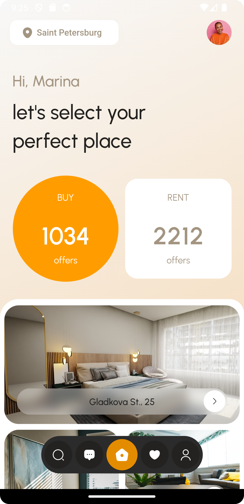
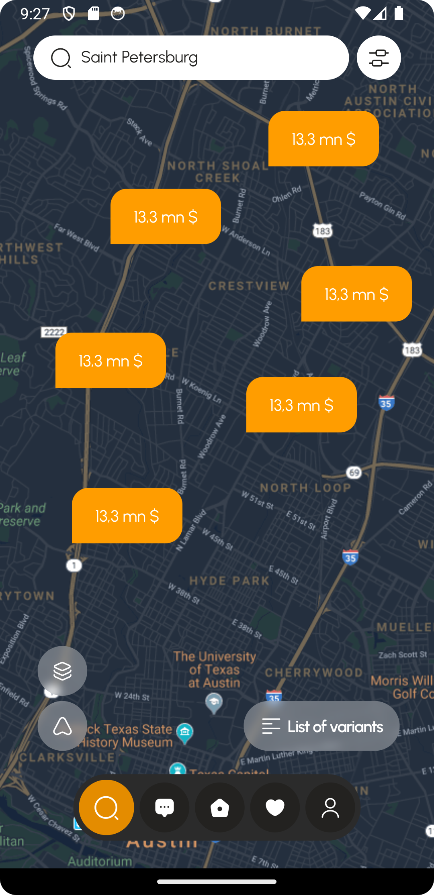
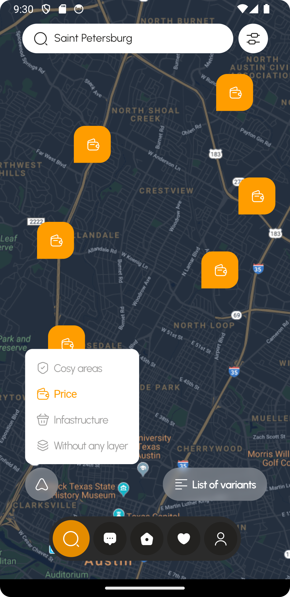

# Real Estate App

The Real Estate Flutter App is a powerful mobile application tailored to simplify the real estate buying and selling process while integrating live location tracking on maps. Developed using Flutter, this app provides a unified, cross-platform solution with an elegant and intuitive interface, catering to the needs of real estate enthusiasts and professionals alike.

## Tools used in building

- flutter `v3.19.5 - mobile sdk`
- hooks_riverpod `state management`
- flutter_hooks `internal state`
- iconsax `icon pack`
- animations `flutter animations package`
- flutter_animate `gskinner animations package`

## App screenshots
<table>
  <tr>
    <td></td>
    <td></td>
    <td></td>
    <td></td>
  </tr>
</table>